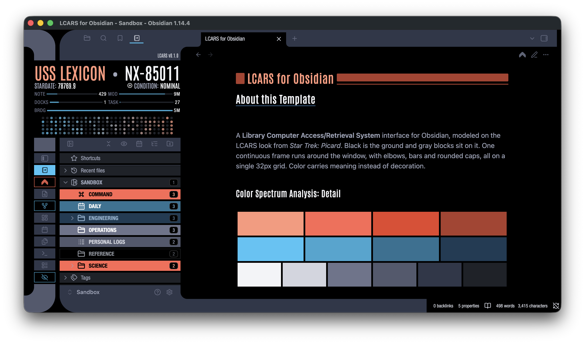
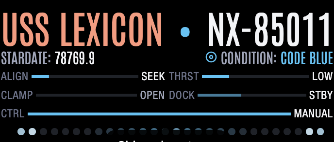
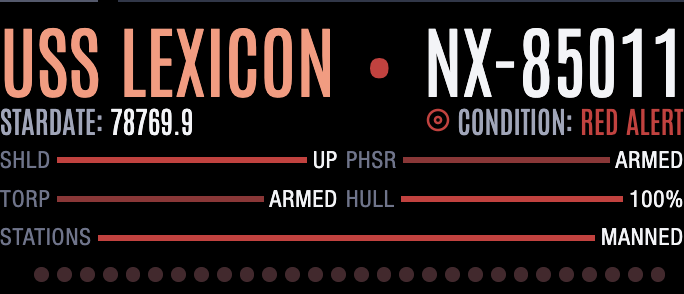
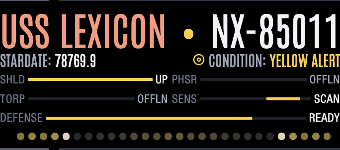
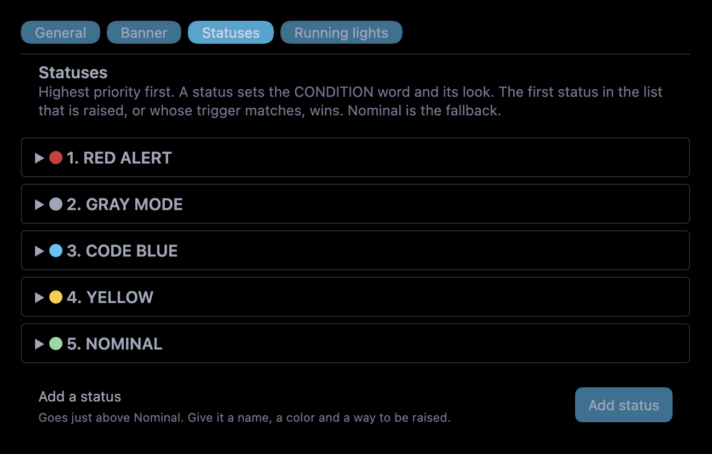
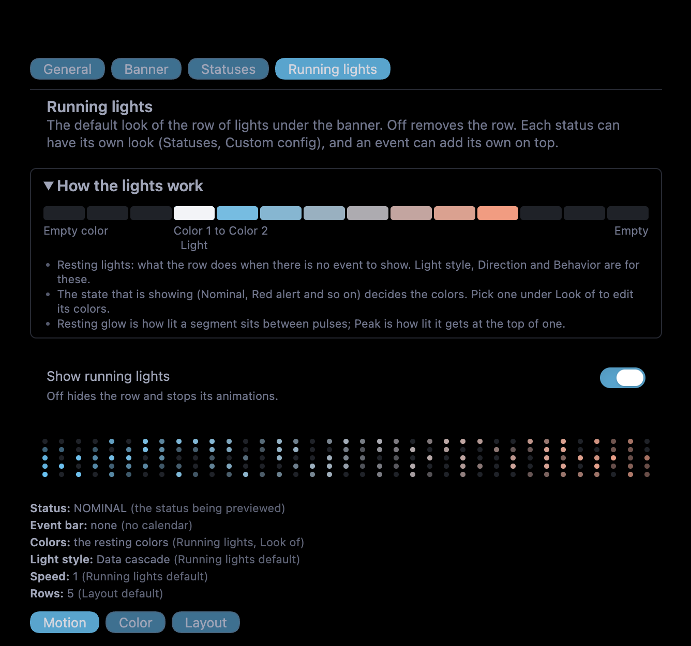

# LCARS for Obsidian

A Picard-era LCARS look for [Obsidian](https://obsidian.md), installed as one plugin, **LCARS for Obsidian**. It brings two things:

- **The theme**: the LCARS frame, palette, motion, ribbon and sidebar rows, built into the plugin's stylesheet. There are no snippets to copy or switch on.
- **The plugin features**: a ship's bridge banner at the top of your sidebar, and a row of **running lights** under it that can show status, time and activity.

> Desktop only. Needs Obsidian 1.13.0 or newer. **Dark mode only: light mode is not supported yet.** Version 0.1.0.

LCARS was designed by Michael Okuda. This is an unofficial fan work; see [CREDITS.md](CREDITS.md).

<p align="center">
  
</p>

The banner changes with the status. Left to right: Code blue, Red alert, Yellow.

|                                                     |                                                     |                                                     |
| --------------------------------------------------- | --------------------------------------------------- | --------------------------------------------------- |
|  |  |  |

The settings pages: Statuses, and Running lights.

| | |
| --- | --- |
|  |  |

## What is in the repository

| Path | What it is |
| --- | --- |
| `main.js`, `manifest.json`, `styles.css` | the LCARS for Obsidian plugin (these three files are what a release ships). `styles.css` holds the theme as well as the plugin's own styles |
| `src/plugin.css` | the plugin's own styles (banner, lights, settings page). `styles.css` is built from this and `snippets/` |
| `snippets/` | the theme sources: `lcars-core.css` (palette, frame, stardate, title blocks), `lcars-motion.css` (every animation), `lcars-nn-rows.css` (Notebook Navigator rows), `lcars-folder-focus.css` |
| `fonts/` | the Antonio font and its license (the font is also built into `lcars-core`) |
| `docs/` | the style guide with its palette swatches, and the extension interface for other plugins |
| `tools/` | helper scripts for maintaining the repository |
| `CHANGELOG.md`, `CREDITS.md`, `LICENSE` | what changed, who to thank, and the license |

## What the plugin does

- **A banner** at the top of the left sidebar (or across the sidebar and the ribbon): ship name and registry, a stardate and clock, a **CONDITION** line, a ship status readout, and an optional embed of your own.
- **Running lights**: a row of segments under the banner. They sit quietly by default, can run moving effects, and take on the look of the current status.
- **Statuses**: a short, ordered list of named states (Red alert, Gray mode, Blue alert, Yellow alert, Nominal, and any you add). Each has its own name, color, text effect and, if you want it, its own lights.
- **Ribbon roles**: each left-ribbon button is colored by where its pane opens (right sidebar, editor, left sidebar), learned the first time you press it.
- **Note title blocks**: the block and stripe beside each note's title.
- **Ship status readout**: five small bars that read your vault: words in the current note (NOTE), time since the note was edited (MOD), open panes (DOCKS), open tasks (TASK), and time since the last daily note edit (BRDG).

The plugin works on its own: the theme is part of it, and every theme variable the banner reads has a fallback.

## Requirements

**Always:** Obsidian 1.13.0 or newer, on desktop. Nothing here runs on mobile.

### The theme (built into the plugin)

*Required*
- **Dark mode.** Settings, Appearance, Base color scheme: Dark.
- **Readable line length off.** Settings, Editor, Readable line length. The theme is tuned with it off: text runs the full width of the pane with 32px side padding. With it on (Obsidian's default) the text sits in a centered column and the spacing looks different.

*Recommended*
- **The Minimal theme.** The frame was built on Minimal's variables, and Minimal is the tested base. It is no longer required: `lcars-core` sets the palette and Obsidian's own colors itself, so with Obsidian's default theme the colors match. Only Obsidian's default theme has been tried besides Minimal, and Minimal's spacing and type refinements are not part of the look without it.
- **Style Manager** (plugin). It gives you the LCARS Palette pickers and the toggles. Without it the dark palette defaults in `lcars-core` still apply and only the pickers are lost.
- **LCARS for Obsidian** (this plugin). Without it the frame is still: no banner, stardate, condition, lights or standby dimming.

*Fonts*
- **Antonio** (SIL Open Font License) is built into `lcars-core`, so there is nothing to install. The plugin's own banner uses it when the `lcars-core` snippet is on. On a Mac, **Helvetica Neue Condensed** is used for small labels when it is installed (Antonio otherwise). The font file and its license are in `fonts/Antonio/`.

*Optional*
- **Notebook Navigator** (plugin). Gives the sidebar its row treatment. Without it the core File Explorer gets the treatment instead, though the row spacing there is not verified.
- **Colorful Folders** (plugin). Gives the folders their heat colors. Without it, rows are drawn in the row background only.
- Use Colorful Folders **5.0.7 or newer**: it sets `--cf-color` on each folder row, which the automatic contrast, the palette pairs, and the folder text keeping its own color when a folder recedes depend on. With an older release, receded folders use a fallback gray and the auto contrast is not available.

*Run by the plugin*
- The ribbon roles and the note title blocks are drawn by the LCARS for Obsidian plugin (Settings, LCARS for Obsidian, General, Interface). With the plugin off, or those switches off, the ribbon stays one neutral column and the title blocks are not drawn.

Which snippet needs what:
- `lcars-core`: nothing required (Minimal and Style Manager recommended).
- `lcars-motion`: `lcars-core`.
- `lcars-nn-rows`: `lcars-core`, Notebook Navigator, Colorful Folders. With no Notebook Navigator it does nothing.
- `lcars-folder-focus`: `lcars-core`, Notebook Navigator, Colorful Folders 5.0.7 or newer (for the folder text colors). With no Notebook Navigator it does nothing.

### The plugin

*Required:* nothing besides Obsidian and the setup under "The theme" above.

*Where the banner sits:* at the top of the left sidebar, or across the sidebar and the ribbon (Settings, LCARS for Obsidian, Banner). It does not depend on Notebook Navigator or the File Explorer.

*Optional, each adds one small thing*
- **Daily notes** (core plugin): the BRDG bar reads its folder from the core setting. You can set the folder in the plugin instead.
- **Copilot** (plugin): the pane readout shows ACTIVE CHAT and its session count, and the frame knows when the Copilot panel is open.
- **Obsidian Git** (plugin): the pane readout shows SOURCE CONTROL with the number of changed files.
- **Dataview** and other plugins: the custom embed on the banner is rendered like a note, so anything that works in a note works there.

## Install

**From the community plugins list** (once it is accepted): Settings, Community plugins, Browse, search for "LCARS for Obsidian".

**By hand:** download `main.js`, `manifest.json` and `styles.css` from the latest release, put them in `<your vault>/.obsidian/plugins/lcars-companion/`, and turn the plugin on under Community plugins.

**The theme comes with the plugin.** There are no snippets to copy or switch on: installing the plugin installs the theme (the frame, palette, motion, sidebar rows and font). Choose Minimal under Settings, Appearance (recommended), turn on dark mode, and turn Readable line length off (see Requirements).

**The theme without the plugin (optional):** copy the four files from `snippets/` into `<your vault>/.obsidian/snippets/` and switch them on under CSS snippets: `lcars-core` first, then `lcars-motion`, `lcars-nn-rows` and `lcars-folder-focus`. Do not use these together with the plugin: it already contains them, and they would load twice. The banner, the lights, the ribbon roles and the title blocks need the plugin.

## Quick start

1. Turn the plugin on. The banner appears at the top of the sidebar.
2. Open **Settings, LCARS for Obsidian, General** and set the ship's name and registry.
3. Click **CONDITION** on the banner to raise a status. Click the status word (for example NOMINAL) to toggle Red alert.
4. Open **Running lights** to choose how the lights look.

## The settings pages

The settings page has four tabs.

### General
The ship's name and registry. **Current status** (the one status raised by hand). Standby: how long with no input before the frame dims, and whether it dims. **Interface**: switches for the ribbon roles and the note title blocks. A **Debug** group: pause all motion, switch the lights' animation off, and **Why the lights look like this right now**, which says where every value of the current lights comes from.

### Banner
Show or hide the banner and choose where it sits (the left sidebar, or across the sidebar and the ribbon). The stardate and its year. The CONDITION block. The ship status channels, each with its own settings. A custom embed (markdown or HTML).

### Statuses
One card per status, **highest priority first**. The first status that is raised, or whose trigger matches, is the one shown. Nominal is the fallback.

Each card has:
- **General**: name, a note to yourself, priority (move it up or down), and a preview.
- **Triggers**: whether it can be raised by hand, how it ends by itself (until cleared, after a time, at a clock time, when another status is raised), and an optional **start time** written as a cron expression, for example `0 9 * * 1-5` for 9:00 on weekdays. Obsidian has to be open at that time.
- **Appearance**: the color (a palette color or any CSS color), how it fades, the text effect (steady, pulse, flash, flicker, glow, scan) and its speed, and **Override the event bar**.
- **Look**: **Custom config** gives the status its own lights with every option the Running lights tab has. Off, it uses the default.

Raised statuses are not saved across a restart.

### Running lights
The default look of the lights, with a moving **How the lights work** panel at the top and a live preview. Three tabs:

- **Motion**: the light style and its preset, speed, direction and behavior (always on, once when you come back from standby, or every so often). Cascade has Flow, Random flicker, Processing activity and a click ripple. **Show advanced settings** adds length, number of lights, spacing, rings and waves, and a Reset.
- **Color**: the resting colors (one, two mixed, or a gradient), the light color, resting glow, peak and the empty color.
- **Layout**: row style (segments, pill, rectangle, circle), caps, width, alignment, how many segments, and **Rows** (1 to 5). Every status shares this layout; a status can only change the number of rows.

Light styles: **Data cascade** (random flicker, with a direction, a mix and a click ripple), **Solid bar** (Heartbeat, Breathe), **Moving dots** (Scanner, Chase, Comet), **Warp core** (waves, rings, and a wide band), and Off.

**Rows** can be set per status (in its Custom config). Changes in the number of rows ease the banner to its new height.

## Commands, links and the API

**Commands** (assign hotkeys in Settings, Hotkeys): *Toggle red alert*, *Toggle gray mode*, and one *Toggle status: NAME* for every other status that can be raised by hand. New statuses get their command the next time the plugin loads. *Toggle ribbon debug logging* writes what the ribbon learned from each press to the developer console.

**Obsidian links** raise and clear statuses from outside Obsidian (a shortcut, a script, Alfred):

```
obsidian://lcars-status?raise=blue
obsidian://lcars-status?raise=blue&until=30     (ends after 30 minutes)
obsidian://lcars-status?clear=blue
obsidian://lcars-status?toggle=red
```

`force=1` clears a status that something else raised. The id is shown on the status's card (General, Id). The built-in ones are `red`, `gray`, `blue`, `yellow` and `green`.

**For other plugins:** `window.lcarsCompanion` offers a small, **experimental** extension interface. See [docs/companion-contract.md](docs/companion-contract.md).

## Theme settings (Style Manager)

With the Style Manager plugin, **LCARS Palette** in Style Manager has pickers and sliders for the frame, ribbon and tab colors, folder text (weight, case, brightness), the sidebar row spacing, the banner (drop and padding), motion (including an **All motion off** switch and the active folder's pulse) and more. Without Style Manager every one of them keeps its default. The dark palette for Minimal's own colors is built into `lcars-core`, so Style Manager is not needed to get the LCARS look.

## Styling

The banner and lights use CSS classes beginning `lcars-bh-` and `lcars-lt-`. To hide the version line, hide `.lcars-bh-version` in a CSS snippet. To turn all motion off at once, use the **Pause all motion** switch under General, Debug.

## Performance

The resting lights are cheap. A few light styles redraw every frame and are marked **(experimental)**: Wide band, Warp core and Warp pulses. They may use more processor time on a slow computer. 4 and 5 rows are also marked experimental.

## Compatibility and limits

- **Dark mode only.** Light mode is not supported yet: the frame, palette and text colors are tuned for Minimal's dark scheme.
- Desktop only (Windows, macOS, Linux). The plugin does not run on mobile.
- Needs Obsidian 1.13.0 or newer (the styles use modern CSS: `pow()`, `hypot()`, `@property`, `color-mix()`).
- The ribbon roles are remembered per vault. A vault that has never learned a button shows it neutral until you press it (a few common buttons are known from the start).
- Notebook Navigator's own Shortcuts and Recent files settings change the sidebar's layout. The theme lines the rows up for the usual combinations; tell us if one looks uneven.
- The version 0.x settings may still change between releases.

## Development

`main.js` is the plugin's source and needs no build. `styles.css` is **generated**: edit `src/plugin.css` or the files in `snippets/`, then run `python3 tools/build_styles.py` (add `--check` to see whether it is stale). The release workflow refuses a tag if it is.

The theme is edited in a vault, in `.obsidian/snippets/`, and copied here into `snippets/`.

`tools/` has `build_styles.py`, which builds `styles.css`, `gen_motion_off.py`, which regenerates the block of CSS that turns motion off, and `embed_font.py`, which rebuilds the embedded Antonio font in `lcars-core` from `fonts/Antonio/`.

## Support

LCARS for Obsidian is free. If you want to say thanks, you can do it on [Ko-fi](https://ko-fi.com/retronified) or [Buy Me a Coffee](https://buymeacoffee.com/retron).

## License

MIT. See [LICENSE](LICENSE). The Antonio font is under the SIL Open Font License 1.1 ([fonts/Antonio/OFL.txt](fonts/Antonio/OFL.txt)).
